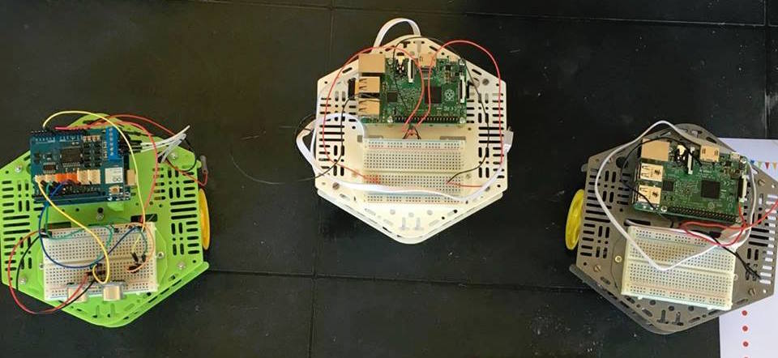

DotBot ROS
===

###Il primo robot didattico che ti permette di imparare ROS

> Questo tutorial si basa sulla versione ancora non stabile di DotBot ROS 0.1, probabilmente molte cose cambieranno e/o verranno migliate nelle versioni future.

DotBot è un progetto OpenSource nato dalle idee di Ludovico Russo e Michele Maffucci per insegnare la robotica nelle scuole. 

DotBot ROS è il sistema operativo che gira all'interno di DotBot su un Raspberry Pi. DotBot ROS è pensato per semplificare l'utilizzo di ROS (il sistema operativo per robot) e renderlo accessibile per l'insegnamento.

DotBot ROS è un insieme di Tool e applicativi che si basano su ROS e su tecnologie WEB. In particolare, tramite DotBot ROS è possibile controllare e programmare DotBot attraverso un qualsiasi web browser.

Di seguito un breve tutorial per capire di cosa si tratta.

##Indice
1. [Introduzione](./tutorials/intro.md)
1. [Costruzione](./tutorials/costruzione.md)

###DotBot ROS
1. [Publisher](./tutorials/connessione.md)
2. [Subscriber](./tutorials/subscriber.md)
