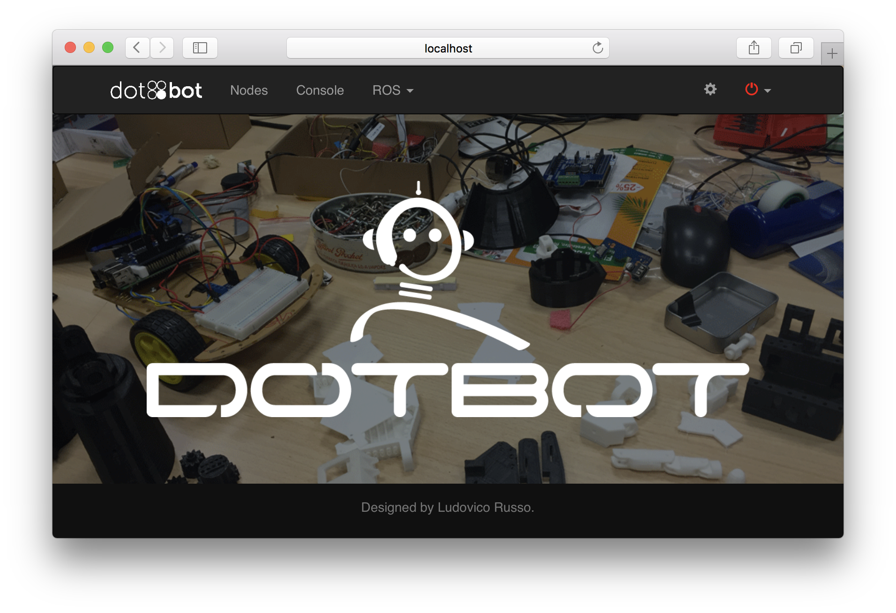
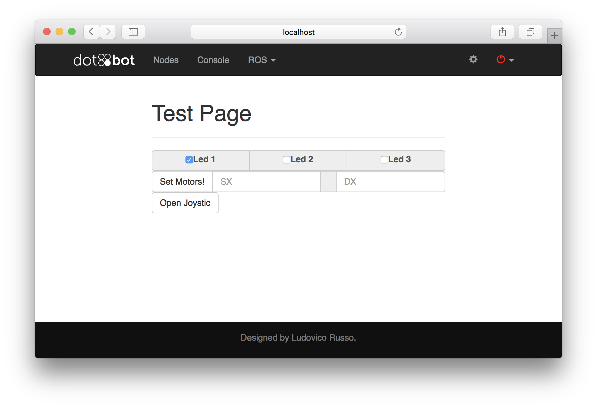
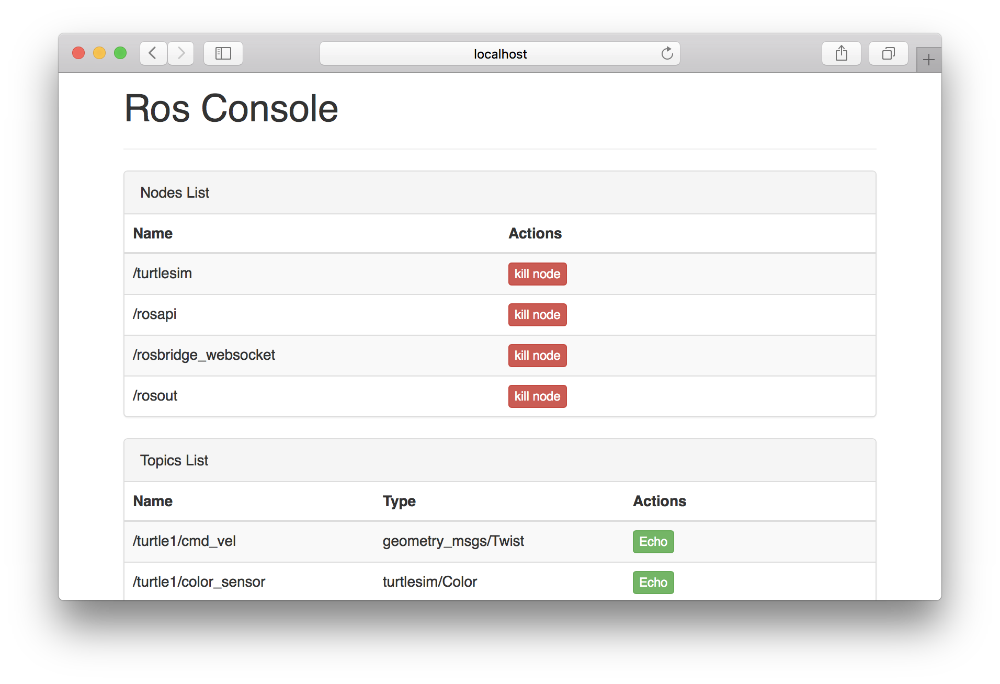
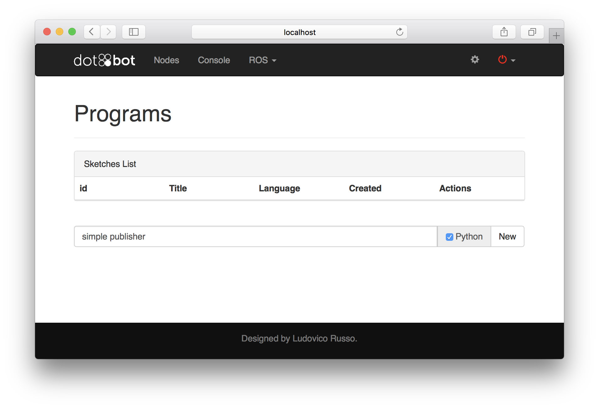

DotBot ROS
===


##Connettersi al Robot

Una volta che il robot sarà connesso alla vostra rete domestica, esso sarà accessibile attraverso l'url [http://dotbot.local](http://dotbot.local). 
Collegandovi al sito web apparirà come pagina iniziale una semplice schermata che rimanda a diverse pagine in cui è possibile controllare o programmare il robot.




###Controllo del Robot

Attraverso la pagina **test** è possibile controllare da semplice webapp i 3 led  e i motori del Robot. Il controllo è molto semplice ed intuitivo, basta infatti selezionare uno dei tre quadratini per vedere il corrispondente led accendersi. Allo stesso modo, una volta inserito un comando di velocità (da -100 a +100) nell'apposito form e aver premuto il tasto **start** vedremo il corrispondente motore muoversi per 2 secondi. 




##Come funziona ROS

ROS è il sistema operativo Open Source creato appositamente per scrivere applicativi (le comuni APP) per Robot. ROS si basa su un sistema di comunicazione remota, che permettono di sviluppare apps per far comunicare tra loro diversi Robot, oppure per mettersi in comunicazione col robot da remoto, come nel caso di questo tutorial. 

###Nodi e Topic in ROS

Ogni programma ROS è chiamato **Nodo**. Un'applicazione in ROS è un insieme di programmi (che possono girare anche su robot diversi) che scambiano messaggi tra loro per eseguire certe azioni. I messaggi vengono scambiati all'interno di appositi canali chiamati **Topic**. Ogni nodo può essere *publisher* o *subscriver* (o entrambi) di un topic, cioè può leggere o scrivere dati.

Per fare un esempio pratico, vediamo cosa succede nel mondo ROS quando accendiamo un led attraverso l'app precedente. Nella nostra applicazioni ROS esistono 2 Nodi. Il primo è il *driver* dei led (chiamato `/dotbot/driver`), cioè un nodo che si occupa di accendere e spegnere il led in base a delle informazioni esterne. Queste informazioni arrivano tramite un topic chiamato `/dotbot/led`, che invia messaggi codificati in informazioni di tipo booleano (cioè _ACCESO_ o _SPENTO_), relative allo stato che devono avere i led. Il secondo nodo è la nostra webapp (chiamata all'interno di ROS `/webapp`), che, al contrario, invia informazioni sullo stato dei led all'interno del topic `/dotbot/led`.

Ogni qual volta premiamo una checkbox della nostra webapp, essa genera un messaggio ROS simile al seguente

```json
{
	'led1': true,
	'led2': false,
	'led3': false
}
```
dove i valori `true` o `false` indicano, rispettivamente, che il rispettivo led deve essere acceso o spento. Diciamo quindi che la webapp è **publisher** del topic `/dotbot/led`.

Per vedere esattamente cosa succede, proviamo ad aprire, in una seconda pagina del browser, la pagina **console** della nostra webapp. Nella pagina vedremo due liste. Andiamo nella seconda lista indicata come **rostopic** e clicchiamo il tasto show relativo al topic `/dotbot/led`. Si aprirà una finestrella in basso allo schermo che mostrerà il messaggio che viene mandato ogni volta che cambiamo lo stato dei led.




Ogni volta che un messaggio viene inviato sul topic `/dotbot/led`, il nodo **driver** viene informato delle nuove informazioni. Questo nodo è **subscriver** del topic. Il nodo legge le informazioni e accende/spegne i led di conseguenza.

Questo funzionamento può essere rappresentato graficamente come segue


Dove i rettangoli sono topic e gli ovali sono nodi. Le frecce rappresentano il flusso di informazioni che vengono scambiate tra i nodi attraverso i topic.

### Cosa si può fare con ROS?

Arrivati a questo punto possiamo fare una brevissima digressione per far capire cosa si può fare utilizzando ROS che è molto difficile fare con altre soluzioni. Pensate per esempio a voler fare un'applicazione Robotica in cui due Robot interagiscono tra loro. Per estendere in modo molto banale l'applicazione vista su, pensiamo a come fare sì che due robot diversi accendano e spengano i led in modo coordinato. Con ROS è semplicissimo, basterà semplicemente far sì che anche il nodo `/dotbot/driver` del secondo robot si sottoscriva al topic `/dotbot/led`. In questo modo entrambi i nodi riceveranno contemporaneamente la stessa informazione mandata da `/webapp` e accenderanno i led in modo coordinato.

###Messaggi ROS

Come detto prima, un topic in ROS è un canale attraverso cui i nodi possono scambiarsi messaggi. Vediamo a questo punto di approfondire brevemente il funzionamento dello scambio di messaggi. In ROS un **messaggio** indica ogni pacchetto di dati (in sostanza l'informazione) che viene scambiato attraverso un topic. Il **tipo di un messaggio** indica invece in che modo le informazioni sono codificate all'interno di un messaggio. Il tipo di messaggio è assimilabile ai tipi di dati dei linguaggi di programmazione. 

Facciamo un esempio pratico: se voglio scambiare parole e/o frasi userò messaggi di tipo `std_msgs/String`, se voglio scambiare numeri con la virgola posso utilizzare il tipo `std_msgs/Float64`, se voglio scambiare valori booleani (Acceso/Spento, Vero/Falso, Zero/Uno, ...) posso utizzare il tipo `std_msgs/Bool`.

Ovviamente i tipi base (tra cui quelli listati sopra e molti altri) sono utilizzati come tasselli per creare tipi complessi. Ad esempio, i messaggi scambiati dal topic `/dotbot/led`, sono di tipo `dotbot_msgs/led`, che contiene all'interno tre valori booleani, come segue:

```c
bool led1
bool led2
bool led3
```

In ROS, ogni topic può scambiare solo messaggi di uno specifico tipo, definito in fase di creazione del topic dal primo publisher del topic stesso. Per questo motivo solitamente si usa *tipo del topic* per indicare il tipo di messaggi che vengono scambiati all'interno del topic.

##Iniziamo a scrivere del codice

A questo punto, capito il funzionamento generale di ROS, possiamo iniziare a scrivere alcuni semplici nodi ROS per iniziare a sviluppare alcune applicazioni robotiche.

ROS permette di sviluppare nodi in due principali linguaggi di programmazione: C++ o Python. In questo tutorial si è scelto di utilizzare Python in quanto più intuitivo e con una sintassi molto più semplice di quella del C++. 

###Creazione di un nuovo progetto in DotBot ROS

Per sviluppare codice da far girare sul robot, DotBot ROS mette a disposizione un semplice tool di programmazione accessibile dal tab **Nodes** della webapp.



## Implementiamo un publisher in Python

Il primo nodo che svilupperemo sarà un semplice publisher ROS sul topic `/dotbot/led` che controllerà i LED del robot in modo da farli accendere. Il codice del Nodo è il seguente

```python
import rospy
import dotbot_msgs.msg

rospy.init_node('led_controller')
pub = rospy.Publisher('/dotbot/led', dotbot_msgs.msg.Led, queue_size=10)
r = rospy.Rate(2) # 2hz
counter = 0
while not rospy.is_shutdown():
	msg = dotbot_msgs.msg.Led #default -> tutti spenti
	if counter % 2 == 0: #controlla che counter sia pari
		msg.led1 = True
		print 'Led 1 -> Acceso'
	else:
		print 'led 1 -> Spento'
	pub.publish(msg)
	counter = counter + 1
	r.sleep()
print 'nodo terminato'
```

Inseriamo questo codice all'interno dell'IDE di programmazione, salviamo e premiamo il tasto _run_. A questo punto, si aprirà una pagina nera (**shell**), che inizierà a scrivere le frasi `'Led 1 -> Acceso'` e `'Led 1 -> Spento'` alternate ad intervalli di mezzo secondo (500 millisecondi). Contemporaneamente all'apparizione di una frase, il led del DotBot si accenderà o spegnerà di conseguenza.

Andando nella pagina **console** della webapp possiamo vedere due cose. Prima di tutto, aprendo il tab del topic `dotbot/led` vedremo che le informazioni venogno inviate a intervalli di 500ms in corrispondenza dell'effettiva accensione o spegnimento del led. Inoltre, all'interno della lista di nodi, vedremo apparire il nodo `led_controller`, che è il nodo che abbiamo appena creato. Per terminare il nodo, basterà cliccare sul tasto **kill node**. Vedremo quindi sulla **shell** la scritta `nodo terminato` e il smettere di lampeggiare.

###Andiamo ad analizzare il codice passo passo.

```python
import rospy
import dotbot_msgs.msg
```

Le prime due istruzioni sono due istruzioni di `import`. Essenzialmente queste istruzioni dicono a Python di andare a cercare le librerie che sono elencate dopo la parola `import`. `rospy` indica la libreria ROS di Python. Questa serve per interagire con il mondo ROS. La libreria `dotbot_msgs.msg` contiene tutti i tipi di messaggi ROS appartenenti al **namespace** `dotbot_msgs`. In altri parole, tutti i tipi di messaggi il cui nome inizia con `dotbot_msgs/`, tra cui, in particolare,  anche `dotbot_msgs/Led`, che intendiamo usare. In python, un tipo di messaggio nella forma  `namespace/Messaggio` è accessible con `namespace.msg.Messaggio`. In particolare, quindi, `dotbot_msgs/Led` è indicato, all'interno di python, come `dotbot_msgs.msg.Led`.

```python
rospy.init_node('led_controller')
```

Questa riga serve ad informare il mondo ROS che questo programma è un nodo ROS. Alla funzione va passato il nome con cui vogliamo che il programma sia identificato all'interno del mondo ROS. Questa istruzione deve essere presente una sola volta in ogni programma ROS e deve essere la prima istruzione eseguita dopo l'import dei vari moduli.


```python
pub = rospy.Publisher('/dotbot/led', dotbot_msgs.msg.Led, queue_size=10)
```

Questa istruzione serve ad informare il mondo ROS che il programma sarà publisher sul topic `/dotbot/led`. L'istruzione chiede come parametro obbligatorio anche il tipo dei messaggi che verranno pubblicati all'interno del mondo ROS, in questo caso `dotbot_msgs.msg.Led`. Il nodo controlla che il topic `/dotbot/led` esista; dopo di che il programma verifica che il tipo del topic che viene passato all'istruzione sia corretto e, in caso negativo, il programma termina. Nel caso in cui il topic non esista, esso viene creato all'interno del mondo ROS. Infine, il programma si registra come publisher del topic, e sarà in grado di inviare messaggi.

```python
r = rospy.Rate(2) # 2hz
counter = 0
while not rospy.is_shutdown():
	[...]
	counter = counter + 1
	r.sleep()
print 'nodo terminato'
```

Questa serie di istruzioni è necessaria per creare un ciclo di istruzioni che viene eseguito a frequenza fissa (in questo caso 2Hz), definita da `r = rospy.Rate(2)`. In particolare, chiamando l'istruzione `r.sleep()` all'interno del ciclo while, essa bloccherà il programma per esattamente 500ms. In questo modo, possiamo far si che tutto quello che avviene all'interno del ciclo `while` sia scandito a frequenza fissa.

Il ciclo `while` termina quando la funzione `rospy.is_shutdown()` ritorna `True`. Questa è una funzione speciale ROS che ritorna sempre `False`, a meno che un segnale esterno dal mondo ROS viene inviato al programma. In questo modo possiamo chiedere al nostro nodo di fermarsi quando vogliamo. In particolare, un modo per inviare questo segnale al nodo è cliccare sul tasto "kill node" della webpage console. L'istruzione `print 'nodo terminato'` viene eseguita una volta terminato il ciclo, al termine del programma.

`counter` è una variabile che viene inizializzata a zero ed incrementata ad ogni ciclo, ci servirà per capire quando spegnere o accendere il led.

```python
	msg = dotbot_msgs.msg.Led #default -> tutti spenti
	[...]
	pub.publish(msg)
```

Queste due istruzioni, contenute nel ciclo `while`, servono a creare un messaggio di tipo `dotbot_msgs/Led` e ad inviarlo, tramite il publisher, sul topic `dotbot/led`. La prima istruzione crea l'oggetto di tipo `dotbot_msgs.msg.Led` chiamato `msg`. La seconda istruzione invia questo oggetto attraverso il publisher `pub`. L'oggetto contiene i tra campi `msg.led1`,  `msg.led2` e `msg.led3` che sono inizializzati (di default) a `False`. In altre parole, se questo oggetto viene direttamente inviato senza cambiare alcun valore al suo interno, i tre led saranno sempre spenti.

```python
	if counter % 2 == 0: #controlla che counter sia pari
		msg.led1 = True
		print 'Led 1 -> Acceso'
	else:
		print 'led 1 -> Spento'
```

Quest'ultimo blocco di istruzioni serve a mettere all'interno del messaggio `msg` i valori corretti per accendere e spegnere il led1 in modo alternato. Dato che vogliamo lavorare solo con il led1, non modificheremo i valori relativi agli altri led (che quindi rimarranno spenti). Dato che abbiamo accesso alla variabile `counter`, che come abbiamo detto prima viene incremetata ad ogni ciclo, per far spegnere o accendere alternativamente il led possiamo semplicemente controllare se `counter` sia pari o dispari. Se `counter` è pari, si accende il led, altrimenti si spegne. 

L'istruzione `counter % 2` (`counter` modulo `2`) ritorna il resto della divisione tra `conter` e 2, in altre parole, ritorna 0 quando couter è pari o 1 quando è dispari. L'istruzione `counter % 2 == 0` ritorna `True` se counter è pari e `False` altrimenti.
Per questo motivo, le istruzioni all'interno del blocco `if` sono eseguite quando counter è pari. In queste istruzioni viene settato il valore di `msg.led1` a `True` (in questo modo il led1 si accenderà quando verrà inviato il messaggio. Al contrario, se counter è dispari, il valore di `msg.led1` non viene toccato, in quanto di defaul è `False` (led spengo).


Possiamo semplificare ulteriolmente questa perte del codice sostituendola come quella che segue

```python
	msg.led1 = (counter % 2 == 0)
	print 'Led 1 ->', msg.led1
```

Infatti, come abbiamo detto, l'istruzione `counter % 2 == 0` ritorna esattamente il valore `True` o `False` che deve essumere `msg.led1`.


###Controlliamo tutti i LED

Per controllare tutti i led, dobbiamo semplicemente modificare leggermente il programma in modo da accedere a tutti e tre i campi di `msg`. In particolare, proviamo ad accendere i led in sequenza. Per far questo, sfruttiamo di nuovo la variabile `counter` e l'istruzione modulo. Avendo a disposizione tre led, possiamo usare l'istruzione `counter % 3` che ritorna, in sequenza, i numeri `0`, `1` e `2`. Accenderemo led1 se `counter % 3` ritorna 0, led2 `counter % 3` ritorna 1 e led3 `counter % 3` ritorna 3. Risulta chiaro che questo si può fare usando le seguenti linee di codice

```python
	msg.led1 = (counter % 3 == 0)
	msg.led2 = (counter % 3 == 1)
	msg.led3 = (counter % 3 == 2)
```

###Codice completo

Di seguito, il codice completo appena realizzato.

```python
import rospy
import dotbot_msgs.msg

rospy.init_node('led_controller')
pub = rospy.Publisher('/dotbot/led', dotbot_msgs.msg.Led, queue_size=10)
r = rospy.Rate(2) # 2hz
counter = 0
while not rospy.is_shutdown():
	msg = dotbot_msgs.msg.Led #default -> tutti spenti
	msg.led1 = (counter % 3 == 0)
	msg.led2 = (counter % 3 == 1)
	msg.led3 = (counter % 3 == 2)
	pub.publish(msg)
	counter = counter + 1
	r.sleep()
print 'nodo terminato'
```

