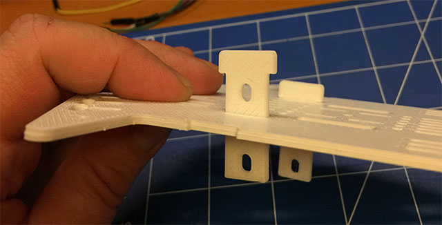
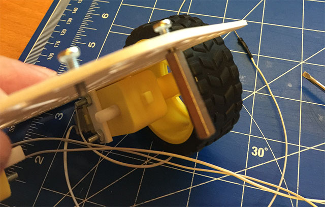
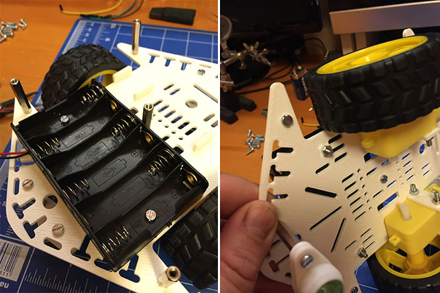
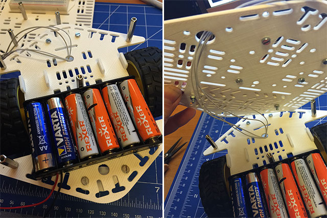

##Dove trovate tutti i sorgenti?

* I file per la realizzazione dello chassis per la stampa in 3D li trovate su: thingiverse
* Il software, basato su ROS, lo trovate su GitHub

Oltre all’implementazione in ROS, io mostrerò in prossimi articoli un utilizzo con l’uso del solo Arduino rilasciando il codice di base da cui partire per implementare le vostre sperimentazioni.

Ovviamente il tutto è in versione beta e suscettibile di modifiche in ogni momento, quindi la frase di rito è: “nessuna responsabilità nostra su errori di progettazione… d’altronde progettandolo nella notte qualcosa può scappare” 🙂

Le versione di cui vi illustro il montaggio è stata stampata in PLA spessore di ogni elemento 2 mm ad esclusione del supporto della breadoboard che è di spessore 1 mm.

Il robot è a base esagonale in quanto nel caso di taglio laser su compensato affiancando gli elementi riduce gli sprechi di materiale, in questo caso alcune modifiche dovranno essere apportate per i supporti dei motori, ma anche in questo caso fornirò la versione definitiva per il taglio laser su compensato.

##Materiale

* n. 13 giunti 25 mm x 3mm
* n. 30 viti M3 da 10 mm (oppure 5 mm)
* n. 4 viti M3 da 30 mm
* n. 10 bulloni M3
* n. 2 biglie di vetro
* n. 2 motorini CC
* n. 2 ruote
* n. 1 contenitore per batterie (6 batterie da 1,5 V AA)
* n. 1 breadboard da 400 fori

Gli elementi da stampare sono n. 12

Alla lista bisognerebbe poi aggiungere l’elettronica di controllo, ma questa parte sarà frutto di un prossimo articolo.

###Passo 1: montaggio dei motori

###Passo 2: montaggio delle ruote passive realizzate con delle biglie di vetro

###Passo 3: inserimento distanziali esagonali per secondo livello

###Passo 4: montaggio del contenitore per batterie

###Passo 5: passaggio cavi motori

###Passo 6: fissaggio breadboard

###Passo 7: supporti per schede di controllo

Lo chassis è stato progettato per ospitare le schede: Arduino UNO R3, tutti i modelli RaspberryPi incluso il Pi Zero.

###Passo 8: blocco batteria 9V

###Passo 9: passaggio cavi motori a livello superiore

###Passo 10: fissaggio del piano superiore e passaggio cavi motore e batteria

Nei prossimi giorni inserirò ulteriori articoli che vi guideranno passo passo alla realizzazione del robot.

Buona sperimentazione a tutti.

