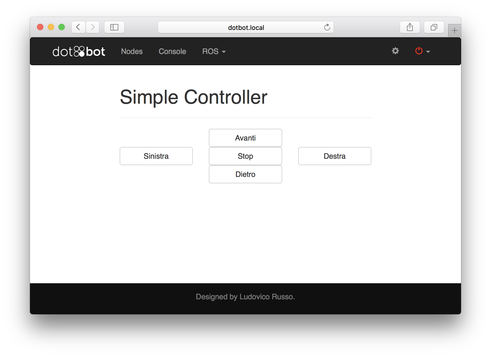
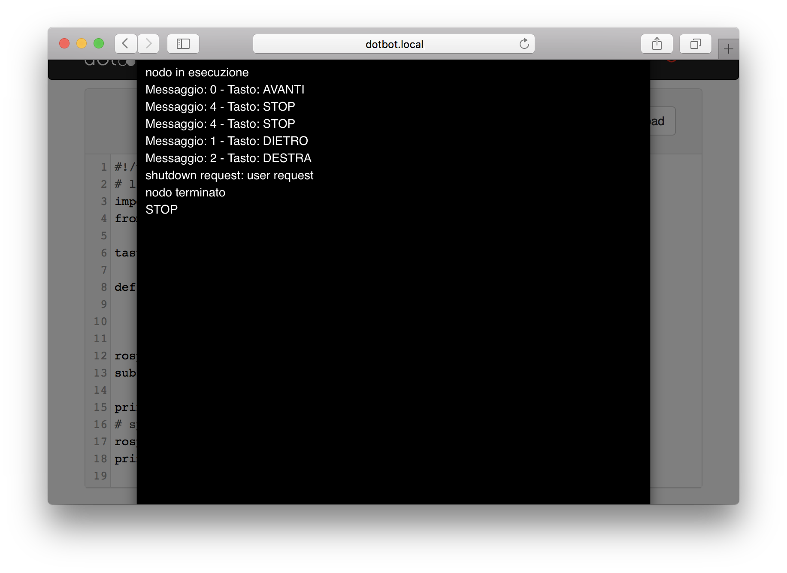
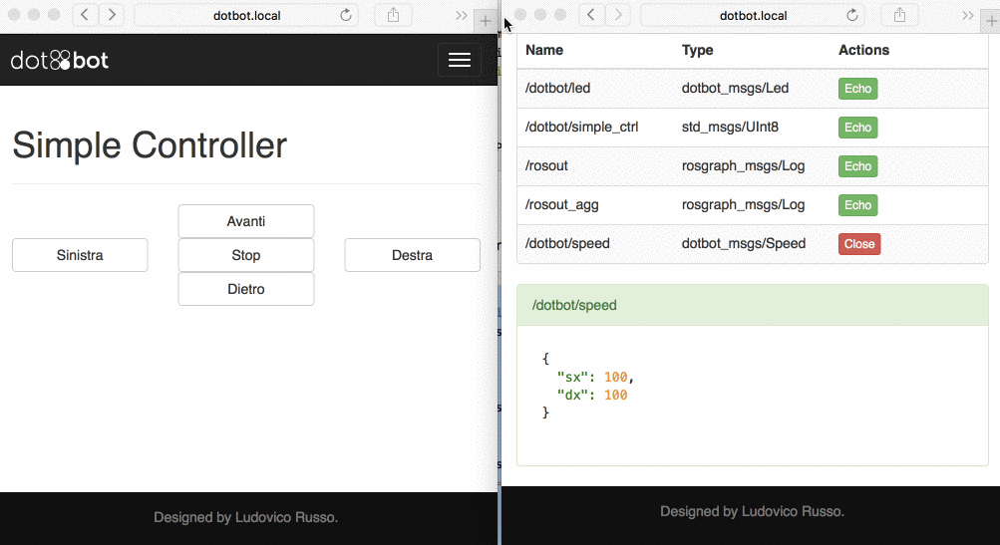

DotBot ROS - Subscriber
===

Abbiamo visto come si può semplicemente implementare un **publisher** su un topic ROS. Vediamo adesso come creare l'oggetto inverso, cioè un **subscriver**, in altre parole, un nodo che riceve informazioni da un topic e le elabora per creare altre azioni.

##Funzioni CallBack
Prima di addentrarci nel codice, è necessario introdurre il concetto di **callback**. Una **callback** è una funziona che non viene chiamata esplicitamente dall'utente che scrive il codice, ma viene invocata automaticamente, solitamente quando uno specifico evento (a cui la callback è associata) si verifica. In quest'ottica, una callback ha la doppia funzione di reagire prontamente al verificarsi di un evento e di elaborare i dati prodotti dall'evento stesso.

Un esempio di callback di cui tutti i sistemi operativi dispongono è la callback associata alla pressione di un tasto da parte della tastiera. Infatti, il programmatore non può sapere quando e se un tasto della tastiera viene premuto, ma sa bene cosa bisogna fare quando l'evento "pressione di un tasto" si verifica. In particolare, le azioni da compiere sono
 
 1. Leggere il codice del tasto che è stato premuto (dati generati dall'evento);
 2. Convertire il codice in informazioni ASCII;
 3. Inviare il carattere al programma in primo piano del Sistema Operativo.

In questo caso, il programmatore scrive la funzione di gestione dell'evento e delega il sistema operativo ad invocare la funzione quando l'evento si verifica.

###CallBack in ROS
ROS frutta tantissimo le callback per gestire in un nodo le informazioni che arrivano da un topic a cui il nodo è sottoscritto. Infatti, le API ROS prevedono una funzione di **callback** per ogni topic a cui il nodo è sottoscritto. Questa funzione si aspetta come unico parametro il messaggio che viene invitato all'interno del topic e non deve ritornare niente.
Questa funzione ha il compito di elaborare i dati contenuti nel messaggio, per questo motivo è anche chiamata **handler** (cioè gestore).

Di seguito le azioni che ROS compie nel momento in cui un messaggio viene pubblicato su un topic:

 1. Il publisher del topic pubblica un messaggio
 2. ROS intercetta il nuovo messaggio e manda una notifica ad ogni nodo sottoscritto al topic informandoli che un nuovo messaggio è disponibile
 3. I nodi sottoscritti chiamano la funzione di **callback** associata a quel messaggio.


## Implementiamo un subscriber in Python

A questo punto siamo pronti per iniziare ad implementare in Python un nodo che si sottoscrive ad un topic. Per fare questo, visitiamo la pagina `http://dotbot.local/gui/simple_ctrl` addessible dalla webapp del robot. Questa pagina presenta una schermata con dei pulsati pensati per controllare il robot remotamente. In particolare, vi sono 5 pulsanti adibiti al controllo della velocità (Avanti, Dietro, Destra, Sinistra, Stop).




Alla pressione di uno di questi pulsanti, verrà pubblicato un messaggio sul topic `/dotbot/simple_ctrl` di tipo `std_msgs/UInt8`. Il tipo `std_msgs/UInt8` definisce un messaggio contenente un unico campo `data` al cui interno è contenuto un numero nel range `[0-255]`. Il valore di questo campo dipende dal tasto premuto, come mostrato in tabella

| tasto | valore |
|:-----:|:-----:|
| AVANTI | 0 |
| DIETRO | 1 |
| DESTRA | 2 |
| SINISTRA | 3 |
| STOP | 4 |

Potete verificare il funzionamento del topic accedento alla pagina `/console` della webapp.

Di seguito riportiamo un semplicissimo codice che si sottoscrive al topic e stampa su shell il tasto che abbiamo premuto.


```python
import rospy
from std_msgs.msg import UInt8

tasti = ('AVANTI', 'DIETRO', 'DESTRA', 'SINISTRA', 'STOP')

def crlt_topic_cb(msg):
	print 'Messaggio: ', msg.data, ' - Tasto: ', tasti[msg.data]
	

rospy.init_node('simple_ctrl')
sub = rospy.Subscriber("/dotbot/simple_ctrl", UInt8, crlt_topic_cb)

print 'nodo in esecuzione'
# spin() evita che il nodo termini prima che venga terminato dall'esterno
rospy.spin()
print 'nodo terminato'
```

Inseriamo questo codice all'interno dell'IDE di programmazione, salviamo e premiamo il tasto _run_. A questo punto, si aprirà la **shell**, in cui apparirà il messaggio `nodo in esecuzione`. Il nodo stamperà a video messaggi nella forma

```
Messaggio: 0 - Tasto: AVANTI
Messaggio: 1 - Tasto: DIETRO
```

solo quando verrà premuto un tasto. Altrimenti non apparirà niente sullo schermo. Come al solito, una volta terminato il nodo da console, apparirà il messaggio  `nodo terminato`.




###Analizziamo il codice passo passo.

```python
import rospy
from std_msgs.msg import UInt8
```

Come già visto, le prime due righe importano la libreria `rospy` e il tipo di messaggio che utilizziremo. In questo caso, utilizziamo la sintassi `from std_msgs.msg import UInt8` per dire che vogliamo utilizzare il tipo `UInt8` all'interno del modulo `std_msgs.msg`. In questo modo potremmo, in seguito, richiamare direttamente `UInt8` invece che utilizzare la sintassi più pensante `std_msgs.msg.UInt8`. Ricordiamo, come già detto, che `UInt8` definisce un tipo di messaggio contenente un unico campo `data`, al cui interno sono contenuti numeri interni nel range `[0-255]`. 

```python
tasti = ('AVANTI', 'DIETRO', 'DESTRA', 'SINISTRA', 'STOP')
```
Creiamo una TUPLA contente i valori elencati. Ricordiamo che una TUPLA si comporta essenzialmente come una lista in Python, con l'unica eccezione che esse è immutabile. In altre parole, non è possibile modificare, aggiungere o eliminare elementi da un oggetto TUPLA una volta che è stato definito. Comportandosi come una lista, possiamo accedere agli elementi contenuti utilizzando l'operatore `[]`. Ad esempio, l'istruzione `tasti[0]` ritornerà la stringa `'AVANTI'`. Possiamo quindi usare l'oggetto `tasti` come un dizionario, per accedere al nome del tasto premuto a partire dal valore contenuto nel messagio.


```python
def crlt_topic_cb(msg):
	print 'Messaggio: ', msg.data, ' - Tasto: ', tasti[msg.data]
```

Definiamo la funzione di callback che verrà chiamata ogni volta che arriva un nuovo messaggio sul topic. In particolare, come già detto, la funzione deve accettare un solo parametro che conterrà, ad ogni chiamata, il valore del messaggio appena mandato. La funzione semplicemente stampa a schermo il valore del messaggio ricevuto (contenuto nel campo `data` di `msg` e il corrispondente tasto premuto, che è ottenuto accedendo alla posizione corrispondente del TUPLA `tasti`. 

Per far capire l'importanza delle tuple ed il loro utilizzo nella semplificazione del codice, proviamo a riscrivere la funzione senza l'utilizzo di quest'ultima.

```python
def crlt_topic_cb(msg):
	nome_tasto = ''
	if msg.data == 0:
		nome_tasto = 'AVANTI'
	elif msg.data == 1;
 		nome_tasto = 'AVANTI'
	[...]
	elif msg.data == 5;
 		nome_tasto = 'STOP'

	print 'Messaggio: ', msg.data, ' - Tasto: ', nome_tasto
```
Come è possibile vedere, l'utilizzo della TUPLA semplifica notevolmente il codice.

A questo punto, tramite l'istruzione già vista `rospy.init_node` registriamo il nostro nodo all'interno del mondo ROS.

```python
sub = rospy.Subscriber("/dotbot/simple_ctrl", UInt8, crlt_topic_cb)
```

`rospy.Subscriber` è il duale di `rospy.Publisher`: questa istruzione fa sì che il nodo venga registrato come sottoscritto al topic `"/dotbot/simple_ctrl"` e ritorna un oggetto che serve a gestire questa sottoscrizione (per ora non è importante sapere come si utilizza ma è importarte sapere che esiste). `rospy.Subscriber` richiede tre argomenti obbligatori:
 
 * il nome del topic a cui il nodo si sottoscrive (`"/dotbot/simple_ctrl"`);
 * il tipo del topic (`UInt8`);
 * la funzione di callback (crlt_topic_cb `).

Come nel caso dei subscriber, ROS controlla che il tipo e il nome del topic siano consistenti e, in caso non lo siano, il programma viene terminato.

A questo punto, il programma è praticamente terminato. Tuttavia è importante notare che il corpo principale del programma non deve fare niente. Tuttavia in Python (come in molti linguaggi di programmazione), se il termine del programma viene raggiunto, allora il programma stesso termina ed eventuali funzioni di callback (che appartengono al programma) non verranno eseguite. Per evitare il termine del programma, `rospy` fornisce l'istruzione `spin()`, che essenzialmente blocca il codice principale finchè il programma non viene terminato dall'esterno. In sostanza, l'istruzione `rospy.spin()` è equivalente a

```python
while not rospy.is_shutdown():
	pass
```

Adesso possiamo capire il senso delle ultime tre istruzioni:

```python
print 'nodo in esecuzione'
# spin() evita che il nodo termini prima che venga terminato dall'esterno
rospy.spin()
print 'nodo terminato'
```
 1. `print 'nodo in esecuzione'` viene eseguita normalemente non appena il nodo è stato creato
 2. `rospy.spin()` evita che il nodo termini e da la possibilità alla funzione di callback di funzionare adeguatamente
 3. `print 'nodo terminato' ` viene eseguita come ultima istruzione quando il nodo viene terminato dall'esterno.


## Miglioriamo il codice in modo da controllare i motori del robot

Per concludere questo tutorial, implementiamo passo passo il codice necessario per far muovere i motori in base al pulsante premuto. Per muovere i motori, bisogna pubblicare un messagio sul topic `/dotbot/speed` di tipo `dotbot_msgs/Speed`. Questo messaggio contiene due campi `dx` e `sx`, riferiti, rispettivamente, al motore destro e sinistro del robot. I valori ammessi sono +100 e -100 (massima velocità in avanti e in dietro).

Il nodo che scriveremo, quindi, sarà un publisher sul topic `/dotbot/speed` e subscriber sul topic `/dotbot/simple_ctrl`. Ogni volta che un nuovo messaggio verrà inviato sul secondo topic, il nodo dovrà generare un messaggio di velocità e mandarlo sul primo.

Per prima cosa, includiamo il tipo del messaggio per la velocità

```python
from dotbot_msgs.msg import Speed
```

A questo punto, possiamo nuovamente sfruttare le Tuple python per generare un dizionario di messaggi da inviare in base al codice che arriva.

```python
speed_msgs = (
	Speed(dx=100, sx=100), 		#AVANTI: entrambi i motori girano avanti
	Speed(dx=-100, sx=-100),	#DIETRO: entrambi i motori girano dietro
	Speed(dx=-100, sx=100),		#DESTRA
	Speed(dx=100, sx=-100),		#DESTRA
	Speed(dx=0, sx=0),			#STOP: motori fermi
)
```
Notare che, in Python, si possono iniziallizare i campi di un oggetto (come nel caso di un messaggio ROS) passandoli come parametri opzionali al costruttore. In altre parole, il codice seguente

```python
msg = Speed()
msg.dx = 40
msg.sx = 60
```
è equivalente all'istruzione 

```python
msg = Speed(dx=40, sx=60)
```
Una volta creata la tupla con gli elementi nel giusto ordine, possiamo accedere al messaggio di velocità da mandare utilizzando l'indice `msg.data`, allo stesso modo in cui accediamo al nome del tasto dalla tupla `tasti`.

Non ci resta, quindi, che creare il publisher sul topic `/dotbot/speed`

```python
speed_pub = rospy.Publisher('/dotbot/speed', Speed, queue_size=10) 
```
e modificare la funzione di callback in modo da utilizzarlo

```python
def crlt_topic_cb(msg):
	speed_pub.publish(speed_msgs[msg.data])
	print 'Messaggio: ', msg.data, ' - Tasto: ', tasti[msg.data]

```

Come ultima accortezza, notiamo che la funzione di callback è definita prima dell'istruzione `init_node`. Per questo motivo, `speed_pub` può essere definito solo dopo la funzione in questione. Questo fa si che la variabile `speed_pub` non possa essere utilizzata dalla funzione in quanto questa non è ancora stata definita al momento di implementazione della funziona. In altra parole, come in molti linguaggi procedurare, ogni variabile può essere utilizzata da un pezzo di codice solo se definita in precendenza. 

Questo problema si risolve molto semplicemente utilizzando delle classi python, che vedermo in seguito. Per risolvere in modo poco elegante il problema senza stravolgere il nostro codice, basterà inizializzare a `None` la variabile `speed_pub` prima della definizione della funzione di callback. In questo modo, la variabile sarà definita prima della funzione e quindi sarà utilizzabile.


```python
speed_pub = None

def crlt_topic_cb(msg):
    speed_pub.publish(speed_msgs[msg.data])
    print 'Messaggio: ', msg.data, ' - Tasto: ', tasti[msg.data]

[...]

speed_pub = rospy.Publisher('/dotbot/speed', Speed, queue_size=10) 

```


###Codice completo

Di seguito, il codice completo appena realizzato.

```python
import rospy
from std_msgs.msg import UInt8
from dotbot_msgs.msg import Speed

tasti = ('AVANTI', 'DIETRO', 'DESTRA', 'SINISTRA', 'STOP')
speed_msgs = (
	Speed(dx=100, sx=100), 		#AVANTI: entrambi i motori girano avanti
	Speed(dx=-100, sx=-100),	#DIETRO: entrambi i motori girano dietro
	Speed(dx=-100, sx=100),		#DESTRA
	Speed(dx=100, sx=-100),		#DESTRA
	Speed(dx=0, sx=0),			#STOP: motori fermi
)

speed_pub = None
def crlt_topic_cb(msg):
	speed_pub.publish(speed_msgs[msg.data])
	print 'Messaggio: ', msg.data, ' - Tasto: ', tasti[msg.data]
	

rospy.init_node('simple_ctrl')
speed_pub = rospy.Publisher('/dotbot/speed', Speed, queue_size=10) 
sub = rospy.Subscriber("/dotbot/simple_ctrl", UInt8, crlt_topic_cb)

print 'nodo in esecuzione'
# spin() evita che il nodo termini prima che venga terminato dall'esterno
rospy.spin()
print 'nodo terminato'
```

Insieriamo il codice nell'IDE di programmazione e lanciamo il nodo. A questo punto, vedremo che potremmo controllare il robot da un qualsiasi browser web (consigliamo di usare uno smarphone). Noteremo subito che, se non mandiamo nuove informazioni di velocità, il robot automaticamente smetterà di muoversi dopo due secondi. Questa soluzione è stata adottata in modo da evitare che il robot continui a muoversi all'infinito se, per qualche problema, un publisher di velocità smette di funzionare.


